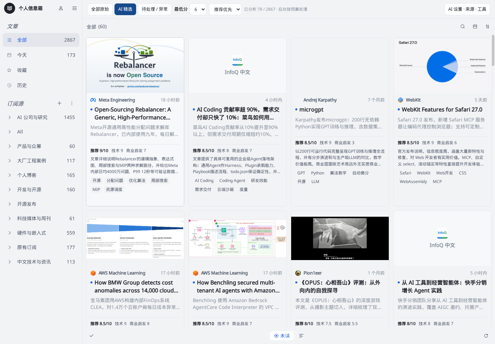
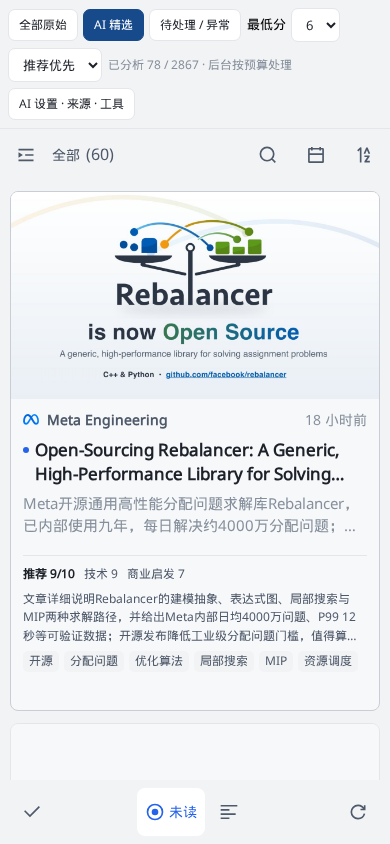

# 个人信息箱 · Personal AI Inbox

个人自用、完整自部署的网页信息收集箱。成熟的 Miniflux 负责订阅、阅读与收藏，ReactFlux 负责图文网页，RSSHub 扩展来源；独立 AI 增强层保存摘要、评分、推荐理由与处理依据，不制造第二份“AI RSS 文章”。

## 日常使用

- 默认进入 **AI 精选**：标题、真实配图、中文短摘要、技术价值、商业启发、推荐理由与标签。
- **全部原始**保留未分析的内容；**待处理 / 异常**展示排队、抓取失败与模型错误。
- 点击文章站内阅读，保留图片和原文链接；已读、收藏、订阅及 AI 结果存在服务器。
- **AI 设置 · 来源 · 工具**中调整模型地址、模型 ID、提示词、分数阈值和预算，管理来源及静态快捷入口。
- 博客先访问原网页；抓取失败不会退化成 RSS 简介后假装完成。社交适配器原帖与网页原文分开标记；超长输入明确标记截断。

手机浏览器布局截图

## 访问入口

日常直接打开 **https://106.53.40.6/inbox/**，无需 SSH 隧道。运行目录 `/home/ubuntu/ai-news`；应用仍只监听 `127.0.0.1:8092`，通过现有 Nginx 443 和 IP TLS 证书提供 HTTPS，没有开放新端口。

ReactFlux 的构建 base、PWA manifest 与 Service Worker scope 均为 `/inbox/`；Miniflux API 保持 `/mf/`。`/news/` FreshRSS 与 `/api/` 小程序后端继续使用原路由。

SSH tunnel 仅用于维护或公网故障备用。示例与主机校验要求见 [访问与备用通道](docs/ops/LOCAL_ACCESS.md)。

用户名为 `reader`。实际管理员密码位于服务器 `.private/miniflux.env`，不是早期 `.private/access.json`；只在自己的终端查看，不上传聊天或 GitHub。

## 验收与运维

- [交付状态与实测边界](docs/ops/DELIVERY.md)
- [逐项验收 Checklist](docs/ops/ACCEPTANCE-CHECKLIST.md)
- [运维、更新、备份与恢复 SOP](docs/ops/SOP.md)
- [HTTPS 访问与备用通道](docs/ops/LOCAL_ACCESS.md)
- [重新构建与接手说明](docs/ops/HANDOFF.md)
- [自动化测试结果](artifacts/unit-tests.xml) · [真实接口与数据验收](artifacts/live-acceptance.json) · [真实浏览器验收](artifacts/browser-acceptance.json) · [隔离恢复验证](artifacts/restore-test.json)

## 必须知道的边界

1. 初始导入包含大量历史条目，**并未将所有历史文章都分析完**。默认每天最多 80 次模型请求、500,000 Token（UTC 日界），在设置中可自行调整；模型失败也会计入请求预算。
2. 当前 Telegram 公共路由实测返回 503，服务器到 t.me / telegram.me 的出站请求失败。X、Instagram 等还需要相应授权，Facebook 未验证。不能把“RSSHub 有适配器”说成“这些账号都已接通”。
3. 三个 arXiv 摘要源保留在候选目录，但没有默认导入为论文全文；PDF 全文、视频理解、评论和完整讨论串不属于已验收能力。
4. 评分是模型判断，不保证事实正确；`evidence` 校验只确认引文存在于实际输入，不证明作者陈述真实。保留配图也不意味着文本模型理解了图片。
5. 每日数据库备份保留最近 14 份，当前仍在同一台服务器。**GitHub 不是文章数据库的异地备份**；私有配置应另行安全保存。
6. 手机测试是 390×844 的独立 Chromium 移动会话，不是物理手机实机；Windows 已验证公网 HTTPS 返回 200；日常使用不需要隧道。

## 开源组成

- [Miniflux](https://github.com/miniflux/v2)：2.3.3，Apache-2.0，官方二进制不改。
- [ReactFlux](https://github.com/electh/ReactFlux)：MIT，固定 SHA + 可复现小补丁，阅读器主体保留。
- [RSSHub](https://github.com/DIYgod/RSSHub)：AGPL-3.0，固定 SHA，私有回环监听。

版本与哈希见 `upstream.lock.json`，研究依据见 `docs/research/`。第三方许可证保留于下载的上游源码。应用是单用户部署，不声称支持多租户隔离。源码、文档和测试证据进入本私有仓库；`.private/`、数据库、备份、日志及二进制运行目录不进入 Git。

预算只约束本项目，保持不动的旧 n8n / 其他应用不在此预算内。订阅刷新配置基准为约30分钟，AI队列约90秒一轮，受原站请求和排队影响，不是秒级实时推送。
